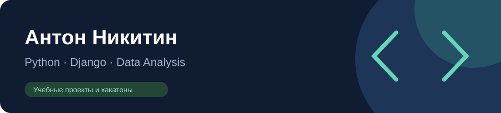

## Привет, я Антон

Развиваюсь в Python-разработке и анализе данных. В этом портфолио собраны учебные приложения, исследования и прототипы для хакатонов. Рассматриваю стажировки и позиции начинающего разработчика.

**Направления:** Python · Django · pandas · scikit-learn · SQL · MongoDB · JavaScript.

## Избранные проекты

| Проект | Что показывает | Технологии |
| --- | --- | --- |
| [Student Burnout](https://github.com/anton-nikitin21/ai-student-burnout) | Подготовка данных, сравнение моделей, Django-интерфейс | Python, scikit-learn, Django |
| [Taxi Service](https://github.com/anton-nikitin21/django-taxi) | Автомобили, водители, заказы, модели и шаблоны | Django, HTML |
| [Airport Traffic](https://github.com/anton-nikitin21/airport-traffic-analysis) | Исследование пассажиропотока и статистические сравнения | pandas, SciPy, Jupyter |
| [Survey Anomalies](https://github.com/anton-nikitin21/survey-anomaly-detection) | Робастные статистики и обработка Parquet | pandas, NumPy, PyArrow |
| [Wine Catalog Bot](https://github.com/anton-nikitin21/wine-catalog-bot) | Парсинг каталога, CSV, графики и Telegram-бот | requests, BeautifulSoup, Telegram |
| [3D Showroom](projects/lassard-showroom-3d) | Интерактивная модель интерьера и инженерные слои | HTML, JavaScript, 3D |

## Ещё в портфолио

| Проект | Содержание |
| --- | --- |
| [Classifier Comparison](https://github.com/anton-nikitin21/ml-classifier-comparison) | Сравнение шести моделей классификации |
| [GPS Anomalies](https://github.com/anton-nikitin21/gps-anomaly-detection) | Расстояния, скорости и визуализация выбросов |
| [MongoDB CLI](https://github.com/anton-nikitin21/mongo-aggregation-cli) | Импорт JSON и aggregation pipeline |
| [Telecom Database Tools](https://github.com/anton-nikitin21/telecom-database-tools) | Инструменты MongoDB и PostgreSQL |
| [HTML Encoding Converter](projects/html-encoding-converter) | Преобразование HTML в UTF-8 и резервные копии |
| [Trace](projects/trace-fintech) | Описание командного финтех-прототипа и ссылка на демо |
| [Web Learning Projects](projects/web-learning-projects) | Ранние HTML/CSS-страницы и JavaScript-игры |
| [Python Learning Archive](projects/python-learning-archive) | Упражнения, небольшие скрипты и первые Django-проекты |

## Как посмотреть работу

В каждом проекте есть README с назначением, составом, зависимостями и ограничениями. Для проектов с данными указаны ожидаемые файлы: частные данные и реальные GPS-траектории не включены в новые публикации. Проекты учебные; достигнутые бизнес-результаты или непроверенные метрики не заявляются.

Для 3D-шоурума доступны [HTML-модель](projects/lassard-showroom-3d/lassard-showroom-v2.html) и [GLB-файл](projects/lassard-showroom-3d/assets/lassard-showroom-engineering.glb). Инженерные схемы предварительные. Trace — командная работа; здесь представлены материалы проекта, его исходный код локально не найден.

При подготовке части работ использовался ИИ. Документация указывает учебный статус, доступные проверки и границы применения.

## Ранние репозитории

[NA21 — Canvas-игра](https://github.com/anton-nikitin21/NA21) · [Python-практика](https://github.com/anton-nikitin21/python) · [polusem — исходная версия исследования](https://github.com/anton-nikitin21/polusem).

Связаться со мной можно через мой [GitHub-профиль](https://github.com/anton-nikitin21).
