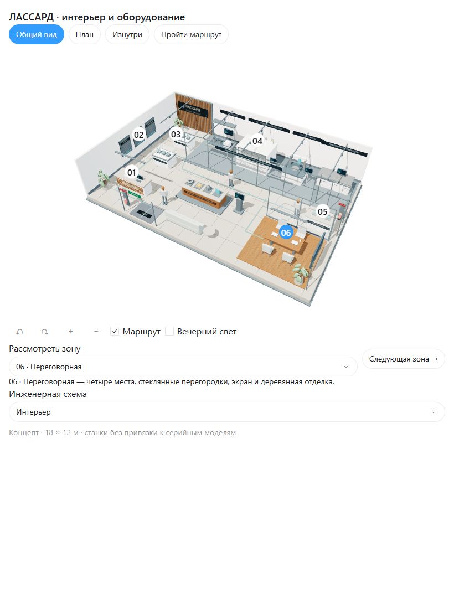

# LASSARD Showroom — 3D Concept

Я создал интерактивную 3D-концепцию шоурума: интерьер, оборудование и переключаемые инженерные слои.

## Запуск

Откройте `lassard-showroom-v2.html` в браузере. Для загрузки внешних библиотек нужен интернет.

## Устройство проекта

Инженерные слои — предварительная концепция для обсуждения, не рабочий проект. Пояснения — `showroom-engineering-notes.md`.

Я публикую исходный код и необходимые пояснения к запуску.

## Предпросмотр

[Скачать 3D-модель GLB](assets/lassard-showroom-engineering.glb)

## Автор

Антон Никитин — [anton-nikitin21](https://github.com/anton-nikitin21).
